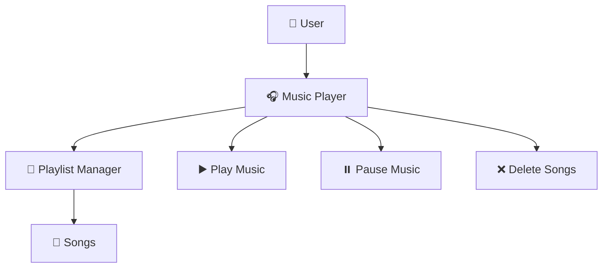

<h1 align="center">🎧 Music Streaming Player 🎶</h1>

<p align="center">
  Modern multimedia music player application with playlist management and streaming interface.
</p>

<!-- 🌊 ANIMATED HEADER -->
<p align="center">
  
</p>

<!-- 🔥 ANIMATED TEXT -->
<p align="center">
  
</p>

<!-- 💎 BADGES -->
<p align="center">
  
  
  
  
  
  
</p>

<!-- 🎵 GIF -->
<p align="center">
  
</p>

---

# 🎯 Project Title

## Music Streaming Player

A modern music streaming and playlist management application designed to provide users with a clean, fast, and interactive multimedia experience.

Features include:

- 🎵 Music playback  
- 📂 Playlist management  
- ➕ Add and remove songs  
- ▶️ Audio controls  
- 📱 Responsive interface  
- 🚀 Smooth streaming experience  

---

# 📚 Table of Contents

- [Project Title](#-project-title)
- [Getting Started](#-getting-started)
  - [Prerequisites](#-prerequisites)
  - [Installation](#️-installation)
- [Usage Examples](#-usage-examples)
- [Architecture](#️-architecture)
- [Running Tests](#-running-tests)
- [Contributing](#-contributing)

---

# 🚀 Getting Started

Welcome to the **Music Streaming Player** project.

This project was created to simulate a modern streaming platform where users can listen to music, manage playlists, and interact with multimedia content through a visually attractive interface.

---

## 📋 Prerequisites

Before running the project, install the following tools:

- Node.js  
- Git  
- VS Code  
- Google Chrome  

---

# ⚙️ Installation

## 1️⃣ Clone the Repository

```bash
git clone https://github.com/your-username/music-streaming-player.git
```

---

## 2️⃣ Enter the Project Folder

```bash
cd music-streaming-player
```

---

## 3️⃣ Install Dependencies

```bash
npm install
```

---

## 4️⃣ Run the Application

```bash
npm start
```

---

## 5️⃣ Open the Application

```bash
http://localhost:3000
```

---

# 🎧 Usage Examples

## ▶️ Play Music

```javascript
const audio = new Audio("song.mp3");
audio.play();
```

---

## ⏸️ Pause Music

```javascript
audio.pause();
```

---

## ➕ Add Songs to Playlist

```javascript
playlist.push("New Song");
```

---

## ❌ Remove Songs

```javascript
playlist.splice(index, 1);
```

---

## 🎵 Interactive Workflow

<p align="center">
  
</p>

---

# 🗂️ Architecture



---

## 📂 Project Structure

```bash
Music-Streaming-Player/
│
├── frontend/
│   ├── index.html
│   ├── style.css
│   └── app.js
│
├── backend/
│   └── server.js
│
├── assets/
│   ├── music/
│   └── images/
│
├── README.md
└── package.json
```

---

# 🛠️ Tech Stack

<p align="center">
  
</p>

| Technology | Description |
|---|---|
| JavaScript | Main programming language |
| Node.js | Backend runtime |
| HTML5 | Structure and layout |
| CSS3 | Styling and animations |
| GitHub | Repository hosting |
| VS Code | Development environment |

---

# 🧪 Running Tests

Run the following command to execute tests:

```bash
npm test
```

---

## ✅ Example Output

```bash
✔ Music player initialized
✔ Playlist loaded successfully
✔ Audio controls working
✔ All tests passed
```

---

# 👥 Team Members

| Role | Full Name |
|---|---|
| The Data Modeler | Rueda Jaime Maria Argel |
| The Query Developer | López Torres Erick de Jesus |
| The Integration Specialist | Peralta Trujillo Oliver |
| The Data Seeder / QA | Torres Hernández David |
| The Scrum Master | Florencio Severiano Jorge |

---

# 🤝 Contributing

Contributions are welcome!

To contribute to this project:

1. Fork the repository  
2. Create a new branch  
3. Make your improvements  
4. Commit your changes  
5. Push your branch  
6. Open a Pull Request  

---

<p align="center">
  
</p>
