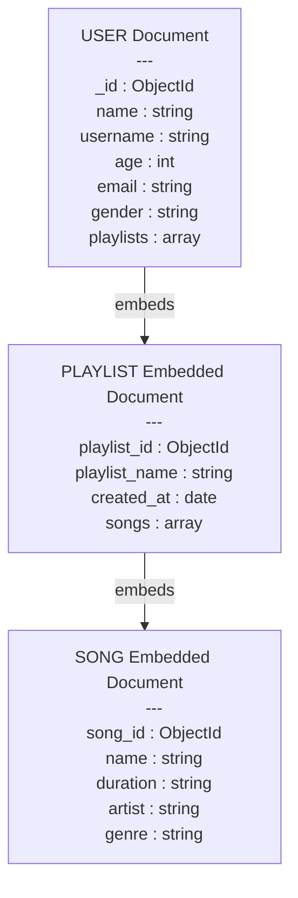

# Playlist System – NoSQL Data Model (MongoDB)

## Description

This project represents a data model for a music playlist system using a NoSQL approach based on MongoDB Document Model.

Users can:

* Create an account
* Create playlists
* Add songs to playlists
* Allow other users to view playlist author and songs

This model uses embedded documents to optimize read performance, which is a recommended practice in MongoDB.

---

## NoSQL Document Structure Overview

Hierarchy:

```
User
 └── playlists[]
       └── songs[]
```

This means:

* A User document embeds many Playlist documents
* Each Playlist embeds many Song documents

---

## Mermaid Diagram (MongoDB Document Model)



---

## MongoDB Example Document

Example of how data is stored in MongoDB:

```json
{
  "_id": ObjectId("65f1a2b3c4d5e6f7890abcde"),
  "name": "Erick Lopez",
  "username": "erickdev",
  "age": 22,
  "email": "erick@email.com",
  "gender": "male",
  "playlists": [
    {
      "playlist_id": ObjectId("65f1a2b3c4d5e6f7890abcd1"),
      "playlist_name": "Rock Classics",
      "created_at": "2026-02-20",
      "songs": [
        {
          "song_id": ObjectId("65f1a2b3c4d5e6f7890abcd2"),
          "name": "Bohemian Rhapsody",
          "duration": "5:55",
          "artist": "Queen",
          "genre": "Rock"
        },
        {
          "song_id": ObjectId("65f1a2b3c4d5e6f7890abcd3"),
          "name": "Hotel California",
          "duration": "6:30",
          "artist": "Eagles",
          "genre": "Rock"
        }
      ]
    }
  ]
}
```

---

## Design Approach

This model uses embedding because:

* Playlists belong to a single user
* Songs belong to a single playlist
* The main query is to view playlists with songs and creator information
* Embedding improves read performance
* Reduces the need for joins (which MongoDB does not use)

---

## Technologies

* MongoDB
* BSON / JSON
* Mermaid.js
* GitHub Markdown

